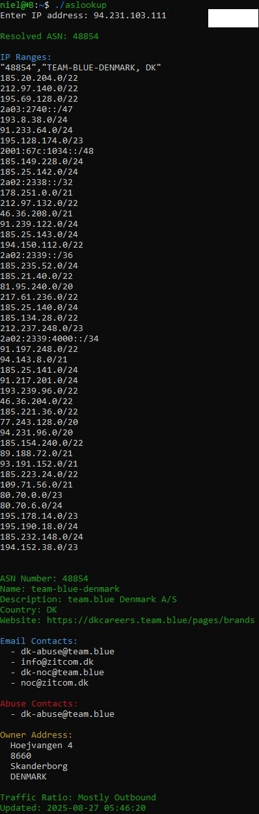

# aslookup

`aslookup` is a C program that performs Autonomous System Number (ASN) lookup for a given IP address. It uses raw DNS queries to Team Cymru's ASN mapping service to retrieve ASN information, then securely fetches associated IP ranges from HackerTarget using HTTPS via libcurl.

## Features

- Raw DNS query to Team Cymru to resolve ASN from IP address
- Correctly parses TXT DNS records to extract full ASN (including leading digits)
- Secure HTTPS request to HackerTarget ASN lookup API using libcurl
- Displays IP ranges and organization details for the ASN
- Displays contact information on the found ASN
- Fully self-contained: no external tools like `whois`, `dig`, or `curl` required

## Installation

### Prerequisites

- GCC compiler
- libcurl development library
- libjcon development library
- libc6 development library

### Install libcurl libjcon-dev libc6-dev (Debian/Ubuntu)


sudo apt-get install libcurl4-openssl-dev libc6-dev

### Compile

```bash
gcc aslookup.c -o aslookup -lcurl -lcjson -lresolv
```

## Usage

```bash
./aslookup --help
./aslookup -i <IP>
```

Example output:




### Releases

There are packages for Ubuntu and Arch Linux in releases
Install with:

Ubuntu:

```bash
sudo dpkg -i aslookup_1.0_amd64.deb
```

Arch:

```bash
sudo pacman -U aslookup-1.0.0-1-x86_64.pkg.tar.zst
```

## Arch Linux Users

If you find this package useful, please consider voting for it on the AUR!  
More votes help increase visibility and the chance for inclusion in official Arch repositories.

To vote, log in to the AUR website and click the "Vote" button on the package page.

[You can find and vote for this package on the AUR page](https://aur.archlinux.org/packages/aslookup)

Thank you for your support!

## License

This project is licensed under the BSD Zero Clause License. See the LICENSE file for details.

## Author

Niel Nielsen
